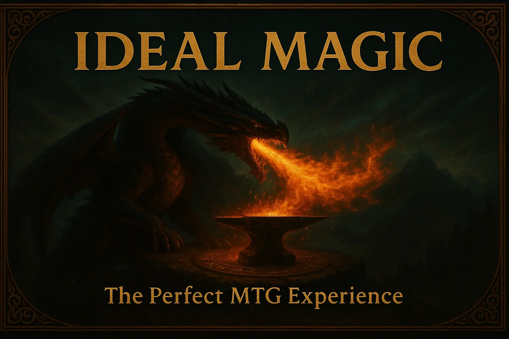

<p align="center">
  
</p>

# Ideal Magic - The Perfect MTG Experience

**Magic at its best** - Ideal Magic is the ultimate curation of Magic: The Gathering, featuring only the most beloved and balanced mechanics while completely removing problematic ones. This isn't a new game—it's Magic as it was meant to be.

[](https://ideal-magic.com)
[](https://discord.gg/DvHRY8h3rs)
[](LICENSE)

---

## **The Magic You Remember at Its Best**

It's the Magic you remember at its best—sharp, interactive, and endlessly replayable—refined until every decision feels clean in the hand and vivid on the table. The rules step out of the way. The drama stays.

You start at twenty life with the London Mulligan, and the game meets you halfway: scry, surveil, cycling, and clues smooth rough draws without erasing variance. Lands remain the heartbeat—one a turn, tap for color, plan your curve—and the color pie still shapes every story you tell.

---

## **What Makes Ideal Magic Special**

### **Best Mechanics Only**

We've carefully curated the "glue suite" of beloved mechanics that make choices sing:

- **Kicker** lets you scale a spell to the moment
- **Cycling** trades dead draws for live ones
- **Flashback** turns your graveyard into a second hand—once, cleanly
- **Foretell** banks a spell for later, adding tension to the turn
- **Adventure** tucks a cantrip of story into your creature
- **Landfall** rewards the rhythm of natural play
- **Sagas** pace a chaptered arc with visible counters
- **Investigate** gives you Clues: half a card now, a whole card when you're ready

Plus **Raid**, **Surge**, and **Rebound** that celebrate the perfect turns without breaking them.

### **No Problematic Mechanics**

We cut the mechanics that asked you to track ghosts or broke the pace:

- **Storm, Dredge, Companion** - format-warping engines
- **Day/Night, Dungeons, Cipher** - off-board bookkeeping
- **Cumulative Upkeep** - escalating maintenance costs
- **"Free engine" loops** that turn games into solitaire

### **Board-First, Paper-Friendly**

Every moving part lives where you can see it: counters on permanents, tokens on the battlefield, choices made openly. No off-board mini-games to babysit, no global timers to forget.

---

## **Start Playing in 4 Steps**

```sh
1. Learn the Rules     → ideal-magic.com/docs/gameplay/quick-start/
2. Print Your Cards    → ideal-magic.com/docs/printing/
3. Join Our Community  → discord.gg/KQTY8DfY
4. Find Opponents      → Play with Discord community
```

**Ready to experience perfect Magic?** **Click the badges above to get started!**

---

## **Our Philosophy**

**Familiar, but lighter in the hand** - The air between turns is clearer, the edges safer, the middle richer. We keep the soul—the bluff, the dance, the little adrenaline braid of "do they have it?"—and remove the sand in the gears.

Ideal Magic rewards planning and invites audacity; says "yes" to interaction and "no" to bookkeeping; makes tomorrow's decisions brighter because today's were fair.

### **Core Principles**

- **20 life, London Mulligan** - Classic starting point
- **Ward over Hexproof** - Interaction with a tax, not a wall
- **Choices over bookkeeping** - Complexity in decisions, not administration
- **Board-state clarity** - Everything important is visible
- **The color pie matters** - Each color has its role and restrictions

---

## **Game Formats**

| Format | Description |
|--------|-------------|
| **Ideal Constructed** | 60+ cards, the complete curated card pool |
| **Eternal (Open)** | Ideal + sanctioned cameo reprints |
| **Limited (Draft/Sealed)** | 40+ cards, designed for clear archetypes |
| **Cube** | Custom pools using Ideal-legal cards |

All formats use the same banlist and philosophy - broad interaction, visible tracking, and meaningful decisions every turn.

---

## **Join the Community**

**[Visit ideal-magic.com](https://ideal-magic.com)** - Complete documentation, rules, and everything you need to play

**[Join our Discord](https://discord.gg/DvHRY8h3rs)** - Active community of players, designers, and contributors shaping the perfect MTG experience

**Contact**: [dunamismax@ideal-magic.com](mailto:dunamismax@ideal-magic.com) - Questions? Ideas? Let's talk!

## Contributing

Contributions are welcome! Visit the [Contributing Guide](https://ideal-magic.com/docs/contributing/) on our website to learn how to get involved in:

### Game Development

- Card curation and balance feedback
- Playtesting and format refinement
- Community events and tournaments
- Documentation and guides

### Technical Development

- Website development and improvements
- Documentation and user experience
- Developer tools and automation
- Performance and accessibility

## Development

This website is built with Hugo and a heavily customized Hextra theme designed for the Ideal Magic experience.

### Design Philosophy

- **Dark theme by default** with MTG mana colors
- **Mobile-first responsive design** for play-anywhere access
- **Performance optimized** with service workers and PWA features
- **Accessibility focused** with proper contrast and navigation

### Technical Details

- Custom theme variables live in `assets/scss/_variables_project.scss`
- All custom styles centralized in `assets/scss/_styles_project.scss`
- Progressive Web App features for offline documentation access
- Optimized for print-friendly card guides and rules references

## License

- **Game Content**: Creative Commons BY-SA 4.0 - Freely usable with attribution
- **Documentation & Code**: Apache License 2.0 - Open source development
- **Website Content**: Apache License 2.0 - Community contributions welcome

See [LICENSE](LICENSE) for complete terms.

---

**Shuffle up. Every line you see is a line you can play.**

Visit **[ideal-magic.com](https://ideal-magic.com)** and join our [Discord](https://discord.gg/DvHRY8h3rs) to experience Magic at its absolute best!

---

<!-- Deployment handled by Cloudflare Pages build (hugo). No GitHub Actions. -->