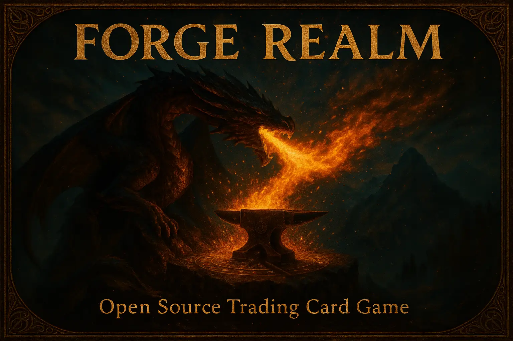

<p align="center">
  
</p>

# Forge Realm TCG - Open Source Magic: The Gathering

**Pure MTG as God intended** - Forge Realm TCG is a fully open-source Magic: The Gathering experience centered around Vintage and Modern formats. Built on principles of transparent development, community governance, and unrestricted access, we're preserving the magic of classic MTG where strategy matters more than your wallet and the community shapes every decision.

[](https://forge-realm.com)
[](https://discord.gg/KQTY8DfY)
[](LICENSE)

---

## **Core Set Launch: Tentative Q1 2026**

The inaugural card set featuring full original artwork, complete mechanics, and balanced 60-card starter decks is in active development. This pure Magic: The Gathering experience embraces the beloved mechanics from Vintage and Modern - including Ward, double-faced cards, predefined tokens (Clue, Food, Map), and selective alternative costs like Bargain. **Join our Discord - we need contributors for card mechanics, artwork, and game design!**

---

## **Why Forge Realm?**

### **For Players**

- **Always Free** - Print any card, build any deck, no Reserved List nonsense
- **Pure MTG Experience** - Classic Magic mechanics without corporate interference
- **Vintage & Modern Focus** - The most strategic and beloved formats
- **Global Access** - Play anywhere with just a printer and some friends

### **For the Community**

- **True Democracy** - Every major decision is voted on by the community
- **Complete Transparency** - All discussions, votes, and development are public
- **Open Source Forever** - Game rules, artwork, and code will always be free
- **No Corporate Control** - Players own and control Magic's future

---

## **Start Playing in 4 Steps**

```sh
1. Learn the Rules     → forge-realm.com/docs/gameplay/quick-start/
2. Print Your Cards    → forge-realm.com/docs/printing/
3. Join Our Community  → discord.gg/KQTY8DfY
4. Find Opponents      → Play with Discord community
```

**Ready to revolutionize TCGs?** **Click the badges above to get started!**

---

## **Our Mission**

**To preserve and democratize Magic: The Gathering's strategic depth for future generations.**

We believe that Magic's incredible gameplay shouldn't be locked behind corporate paywalls or artificial scarcity. Forge Realm represents a return to pure Magic where:

- **Players control the game**, not Hasbro shareholders
- **Strategy matters more** than your collection value
- **Communities thrive** through collaboration, not chasing expensive singles
- **Classic Magic lives on** through democratic participation, not corporate decisions

---

## **What Makes Us Different**

| Corporate MTG | Forge Realm MTG |
|---------------|------------------|
| Reserved List gatekeeping | All cards freely available |
| $200+ Modern decks | Print-and-play for $20 |
| Hasbro profit focus | Pure gameplay focus |
| Closed development | Transparent process |
| Standard format pushing | Vintage/Modern emphasis |

---

## **Join the Revolution**

**[Visit forge-realm.com](https://forge-realm.com)** - Complete documentation, rules, and everything you need to play

**[Join our Discord](https://discord.gg/KQTY8DfY)** - Active community of players, designers, and contributors shaping the game's future

**Contact**: [dunamismax@forge-realm.com](mailto:dunamismax@forge-realm.com) - Questions? Ideas? Let's talk!

## Contributing

Contributions are welcome! Visit the [Contributing Guide](https://forge-realm.com/docs/contributing/) on our website to learn how to get involved in:

### Game Development

- Game design and balance
- Card artwork and graphics
- Playtesting and feedback
- Community events and testing

### Technical Development

- Website development and improvements
- Documentation and guides
- Developer tools and automation
- Performance and accessibility

## License

- **Game Content**: Creative Commons BY-SA 4.0 - Freely usable with attribution
- **Documentation & Code**: Apache License 2.0 - Open source development
- **Website Content**: Apache License 2.0 - Community contributions welcome

See [LICENSE](LICENSE) for complete terms.

---

**Ready to play? We'll be there soon!** Visit **[forge-realm.com](https://forge-realm.com)** and join our [Discord](https://discord.gg/KQTY8DfY) to join us on this journey!
